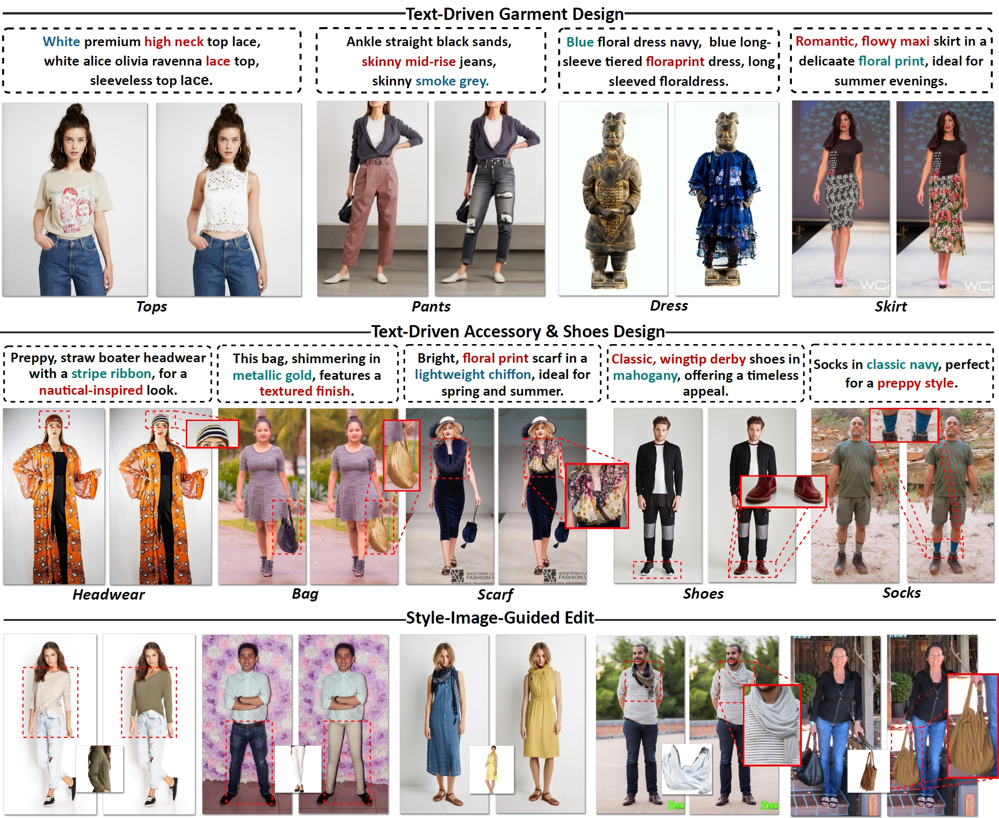
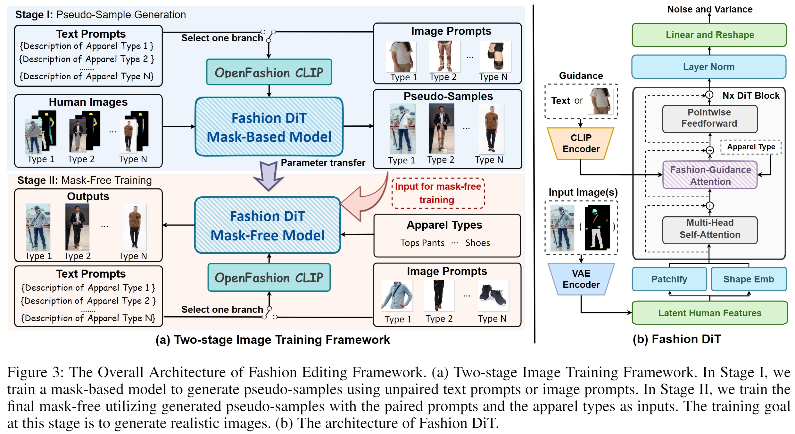

# AnyDesign
Official repo for [__AnyDesign: Versatile Area Fashion Editing via Mask-Free Diffusion__](https://arxiv.org/abs/2408.11553)
## Overview

## Framework

## FGA Module

## TODO
- [ ] Release the code of the data extension method.
- [ ] Release the code of the fashion editing model.
